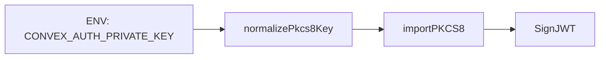

# DESIGN004 - Normalize Convex Auth Private Key

**Status:** Draft
**Date:** 2026-01-16

## Overview

Vercel runtime throws `SessionTokenError` because `CONVEX_AUTH_PRIVATE_KEY` is not formatted as PKCS#8 when copied into environment variables. Normalize the key by stripping wrapping quotes and converting `\n` escapes to actual newlines before calling `importPKCS8`, and surface a clearer error when invalid.

## Architecture

- Introduce `normalizePkcs8Key` helper in `src/lib/convex-auth-key.ts`.
- `src/server/auth-utils.ts` uses the helper before `importPKCS8`.
- Add a unit test to validate normalization rules.

## Data Flow

## Interfaces

- `normalizePkcs8Key(raw: string): string`
- `getPrivateKey()` now normalizes and validates before parsing.

## Error Handling

- Throw a descriptive error if the key is missing or invalid, with guidance to regenerate keys and fix Vercel env formatting.

## Tasks

- Add `normalizePkcs8Key` helper and unit tests.
- Update `auth-utils` to normalize before parsing.
- Update README guidance for Vercel env formatting.
- Run lint/format and targeted unit test.
